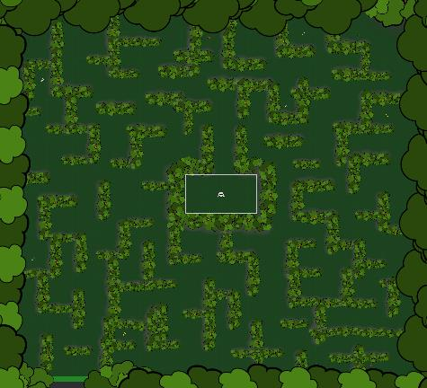
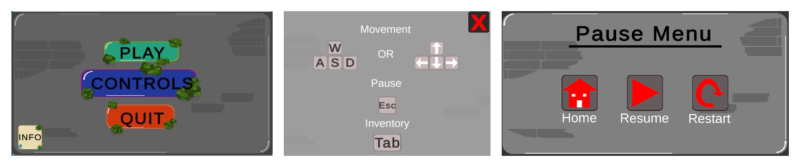
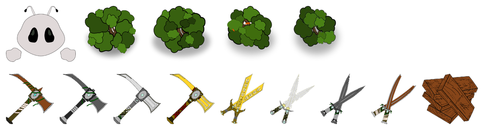

# Bob Năstrușnicul (*"Bob the Trickster"*)

A 2D top-down maze adventure built in **Unity** with **C#** — a mischievous alien has to escape a living maze of trees on a planet that looks suspiciously like Earth, collecting magical artifacts along the way.

> **Note on this repo:** the original Unity source project was lost in an OS reinstall, so this repo doesn't contain browsable source code. What's here is the final compiled build (playable, under [Releases](../../releases)) plus a full write-up of how the game was designed and built, based on the original project documentation.

## Table of contents
- [About](#about)
- [Features](#features)
- [Screenshots](#screenshots)
- [Controls](#controls)
- [Play the game](#play-the-game)
- [How it was built](#how-it-was-built)
- [Tech stack](#tech-stack)
- [Minimum requirements](#minimum-requirements)
- [Background & credits](#background--credits)

## About

Bob is trapped in a labyrinth grown from trees by the "anti-tricksters," and the only way out is to find the exit while grabbing as many of the 9 hidden artifacts as he can along the way. The whole game — movement, menus, inventory, and all — was built from scratch as a way to learn Unity and C# for the first time.

Every piece of 2D art in the game (the character, the trees, the UI buttons, all 9 collectible items) was hand-drawn from scratch in **Inkscape**.

## Features

- Hand-built top-down maze with tree-based walls and a clear finish line
- 8-directional movement (`WASD` or arrow keys), with the character rotating to face the mouse cursor
- Smooth camera-follow so the player is always centered
- A working **9-slot inventory system**: walk into an item to pick it up, view/manage it in an on-screen inventory, and drop items back into the world (they get re-instantiated at your feet with a small physics "toss")
- 9 collectible artifacts across 3 tool types (axe, sword, plank) × 4 material tiers (wood, stone, iron, gold)
- Full menu flow, each screen wired up with its own scene-loading / show-hide logic:
  - **Main Menu** → Play / Controls / Info / Quit
  - **Pause Menu** (mid-game) → Home / Resume / Restart
  - **Win screen** → Replay / Quit / Menu
- A small persistent `GameManager` / `ItemManager` layer that survives scene loads and keeps track of every item prefab, so dropped items can be reinserted into the world correctly

## Screenshots

**UI flow** — Main Menu, Controls overlay, Pause Menu:

**Original artwork** — the player character, the 4 tree-wall variants, and all 9 collectible tools/weapons, all drawn in Inkscape:

## Controls

| Action | Input |
|---|---|
| Move | `W A S D` or Arrow keys |
| Face direction | Mouse |
| Open / close inventory | `Tab` |
| Pause | `Esc` |

## Play the game

The game only runs on Windows (64-bit). No installation needed:

1. Download the latest `.zip` from [Releases](../../releases)
2. Extract it
3. Run `BobNastrusnicul_.exe`

> Windows SmartScreen may warn you about an unrecognized app since the executable isn't code-signed — this is expected for a small student project. Click "More info" → "Run anyway" if you trust the source (you built it, after all).

## How it was built

The source project isn't in this repo, but here's how it was put together, straight from the original design notes:

**MainMenu scene**
- `MainMenu` — Play / Controls / Informations / Quit buttons
- `ControlsPanel` — shows movement/pause/inventory key hints, closed with a `Cancel` button
- `InformationsPanel` — game objective, pickup instructions, artifact gallery, credits

**MainWorld scene**
- `Player` — `Rigidbody2D` (gravity + Z-axis rotation disabled) + custom movement script + `CircleCollider2D` + inventory component
- `Grid` / `Maze` — a colored `Tilemap` for the ground, and tree objects (sprite + `Collider2D`) forming the maze walls
- `FinishLine` — a trigger collider that checks for the `Player` tag and loads the win scene
- `Artifacts` — 9 collectible prefabs, each with a sprite, collider, `Rigidbody2D`, and an `Item` component pointing at its `ItemData` (name + icon)
- `HUD` — the inventory panel and the in-game pause menu

**EndingMenu scene**
- Win screen with Replay / Quit / Menu buttons

**Key scripts (as originally designed)**

| Script | Responsibility |
|---|---|
| `PlayerMovement` | Reads WASD/arrow input into a normalized movement vector each `FixedUpdate` |
| `LookAtMouse` | Rotates the player to face the mouse cursor in world space |
| `CameraFollow` | Smooth-damps the camera position onto the player |
| `Inventory` | Slot-based inventory logic: add/remove/stack items, enforce max-per-slot |
| `InventoryUI` | Refreshes the on-screen slots every frame, handles opening/closing and dropping items |
| `Item` / `ItemData` | Per-artifact data holder (name, icon) + the `Rigidbody2D` requirement that makes something "collectable" |
| `Collectable` | Detects overlap with the player and hands the item off to the inventory |
| `ItemManager` | Keeps a dictionary of every item type in the game so dropped items can be found and re-spawned |
| `GameManager` | Persists item references across scene loads |
| `FinishLine` | Detects the player and triggers the win scene |

## Tech stack

- **Unity** (2D)
- **C#**
- **Inkscape** — 100% original 2D artwork

## Minimum requirements

- 64-bit OS (Windows)
- Intel Core-class CPU @ 2.3 GHz or better
- Integrated graphics
- 4 GB RAM, ~350 MB free disk space

## Background & credits

This project started as my final assignment ("atestat") for the professional Computer Science competency exam in high school — my first real project in Unity and my first time learning C#. The original academic write-up (in Romanian) is included under [`docs/`](docs/atestat-documentation-ro.pdf) for anyone curious about the process.

Learning resources used along the way:
- [Sharp Coder — Building a top-down shooter in Unity](https://www.sharpcoderblog.com/blog/building-a-top-down-shooter-game-in-unity)
- YouTube: EPICALUXDEV, ChrisTutorialsYT, CouchFerretmakesGames, gamedevwithjacquelynnehei465
